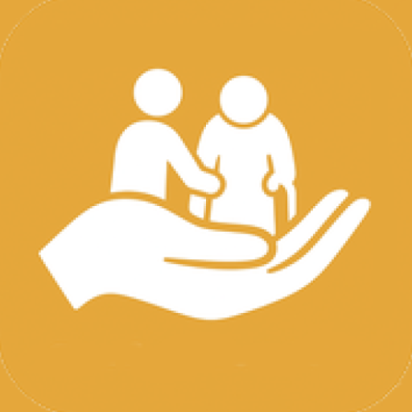

# 🔐 SafeHands

**SafeHands** è un'applicazione nativa Android (scritta in Kotlin) progettata per facilitare l'assistenza remota e il monitoraggio dei propri cari. L'applicazione crea un collegamento sicuro e in tempo reale tra due ruoli utente distinti:

1.  **Parent (Assistito):** L'utente che riceve assistenza. Può creare liste di attività e ricevere aggiornamenti in tempo reale.
2.  **Caregiver (Assistente):** L'utente che fornisce assistenza. Può visualizzare le attività, contrassegnarle come completate e inviare parametri vitali.

L'intero backend è gestito tramite **Firebase (Authentication, Firestore, Functions e Messaging)** per garantire sicurezza, scalabilità e reattività in tempo reale.

## 🏛️ Architettura e Flusso Utente

L'app si basa su un'architettura a due ruoli, che inizia dalla schermata di selezione iniziale.

### 1. Flusso "Parent" (Assistito)

L'utente "Parent" ha il pieno controllo gestionale sull'account.

* **Autenticazione Completa:** Il Parent si registra e accede tramite Firebase Authentication (Email/Password). Alla registrazione, vengono creati i documenti iniziali su Firestore.
* **Gestione To-Do List:** Può creare, modificare ed eliminare task (es. "Prendere pillola ore 8:00").
* **Notifiche Push in Real-Time:** Riceve notifiche istantanee (tramite Firebase Cloud Messaging) quando un Caregiver completa un task o invia una nuova misurazione dei parametri.
* **Log Notifiche:** Può consultare uno storico di tutte le notifiche relative ai parametri ricevuti (es. "Nuova misurazione: Glicemia").
* **Gestione Account:** Può aggiornare il proprio numero di telefono e disconnettersi tramite un menu laterale a scomparsa (Navigation Drawer).

### 2. Flusso "Caregiver" (Assistente)

L'utente "Caregiver" ha funzionalità focalizzate sull'esecuzione e l'inserimento dati.

* **Collegamento Sicuro:** Il Caregiver non si registra. Si collega a un account Parent esistente inserendo l'email del Parent. Una Cloud Function (`getUidFromEmail`) valida l'email e associa i due account in modo sicuro.
* **Visualizzazione To-Do List:** Vede la lista dei task creata dal Parent in tempo reale (grazie ai listener di Firestore).
* **Completamento Task:** Può contrassegnare i task come "completati" con un clic. L'aggiornamento dello stato è gestito da una Cloud Function (`updateTaskStatus`) per sicurezza e per inviare la notifica al Parent.
* **Invio Parametri Vitali:** Può inviare misurazioni per Pressione, Glicemia, Ossigenazione e Temperatura. I dati vengono inviati tramite una Cloud Function (`saveParameter`).
* **Interfaccia Semplice:** La navigazione avviene tramite una Bottom Navigation Bar per un rapido accesso alle sezioni To-Do e Parametri.

## 🛠️ Stack Tecnologico e Architettura

Questo progetto utilizza un'architettura moderna basata su **Kotlin** e **Firebase**.

### Frontend (App Android)

* **Linguaggio:** 100% [Kotlin](https://kotlinlang.org/)
* **UI:** Android XML (View System tradizionale)
    * **Componenti:** `Fragment`, `RecyclerView`, `BottomNavigationView`, `DrawerLayout`, `CardView`.
    * **Layout:** `LinearLayout`, `GridLayout`, `FrameLayout`.
* **Asincronia:** Callback di Firebase e Listener.

### Backend (Serverless)

L'intero backend è serverless e sfrutta i servizi di **Google Firebase**:

* **Firebase Authentication:** Per la gestione sicura di registrazione e login (Email/Password).
* **Firebase Firestore:** Database NoSQL per la persistenza dei dati in tempo reale.
    * `users/{user_doc_id}`: Salva il token FCM e il numero di telefono del Parent.
    * `caregivers/{parentUid_caregiverId}`: Mappa l'associazione tra Parent e Caregiver.
    * `todoLists/{parentUid}/tasks/{taskId}`: Contiene i task per un Parent.
    * `parameters/{parentUid}/recived/{paramId}`: (Inizializzato in `LoginActivity`, poi gestito dalla Cloud Function `saveParameter`).
    * `parameters_notify_log/{user_doc_id}/...`: (Nome collezione dedotto da `ParametersNotifyLogFragment`) Log delle notifiche mostrate al Parent.
* **Firebase Cloud Functions:** Utilizzate come "backend sicuro" per centralizzare la logica di business e inviare notifiche.
    * `getUidFromEmail`: Chiamata dal Caregiver per trovare e validare l'email del Parent.
    * `updateTaskStatus`: Chiamata dal Caregiver per segnare un task come completato; aggiorna Firestore e invia una notifica FCM al Parent.
    * `saveParameter`: Chiamata dal Caregiver per salvare i parametri vitali; salva su Firestore e invia una notifica FCM al Parent.
    * `saveParameterNotification`: Chiamata dall'app *stessa* del Parent quando riceve una notifica, per salvare un log di essa.
* **Firebase Cloud Messaging (FCM):** Gestisce l'invio e la ricezione di notifiche push tra i dispositivi.

## ⚖️ Licenza

Questo è un progetto proprietario. L'accesso al codice è fornito esclusivamente per scopi di consultazione e valutazione portfolio.

Per i dettagli completi, si prega di consultare il file [**LICENSE.md**](LICENSE.md).

## 📋 Nota per i valutatori

Questo repository è pubblico per scopi di dimostrazione portfolio. Per motivi di sicurezza e per proteggere le chiavi API:

* Il file `google-services.json` (che contiene le chiavi Firebase) è stato intenzionalmente escluso dal repository tramite `.gitignore`.
* Il progetto **non compilerà** senza un file `google-services.json` valido collegato a un progetto Firebase con la struttura Firestore e le Cloud Functions corrispondenti.